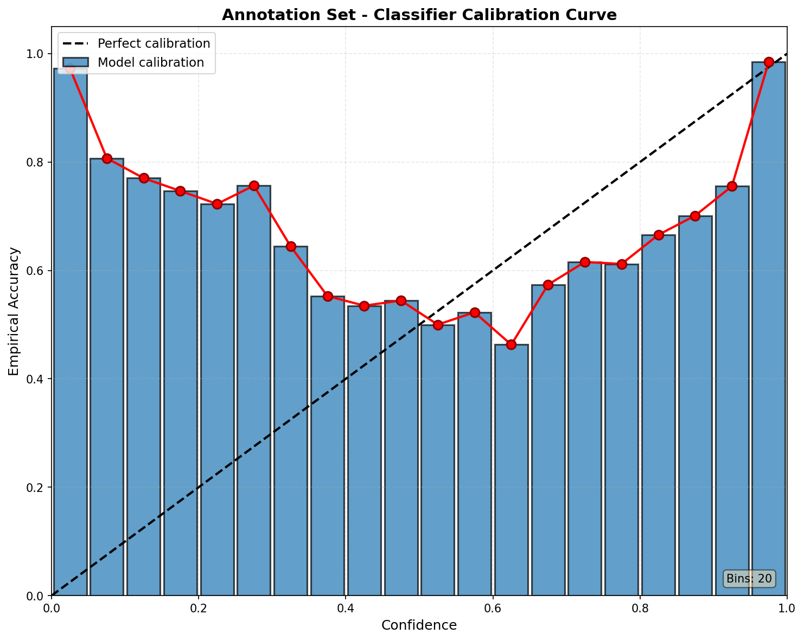

# Training: Harmful Prompt Classification

## Model Selection
[ModernBERT](https://arxiv.org/abs/2412.13663) was chosen because it consistently improves downstream results versus the BERT family while matching or exceeding baselines in the paper's evaluations. Those empirical gains motivated using `answerdotai/ModernBERT-large` for this classifier.

- Model size: ModernBERT-large ≈ 395M parameters.
- We opted to use an Ensemble to improve robustness and uncertainty estimation.

## Data used
We train on the training set and (manually) optimize hyper-parameters using the validation set.

## Important hyper-parameters

The canonical configuration lives in `configs/train_config.yaml`. Key hyperparameters used for the ensemble training are:

- `model.name`: `answerdotai/ModernBERT-large`
- `model.max_length`: 2048
- `training.num_train_epochs`: 5
- `training.per_device_train_batch_size`: 48
- `training.learning_rate`: 1e-4
- `training.lr_scheduler_type`: `cosine`
- `training.warmup_ratio`: 0.1
- `training.optim`: `adamw_bnb_8bit`
- `training.torch_compile`: true
- `ensemble.enabled`: true
- `ensemble.num_models`: 3
- `Precision`: bfloat16 (bf16)

We log all runs and metrics to Weights & Biases (wandb). The ensemble of 3 ModernBERT-large models achieved an F1 Score of 95.8%

### Model Calibration

The ensemble was evaluated on the annotation set using a calibration curve. The model exhibits:
- **Underconfidence**: predicted probabilities are lower than actual accuracy
- **Calibration Error**: 0.27

## Dataset

The raw annotation set with the ensemble's confidence has been uploaded to Hugging Face: `Jazhyc/wildguard-annotated-intents`
