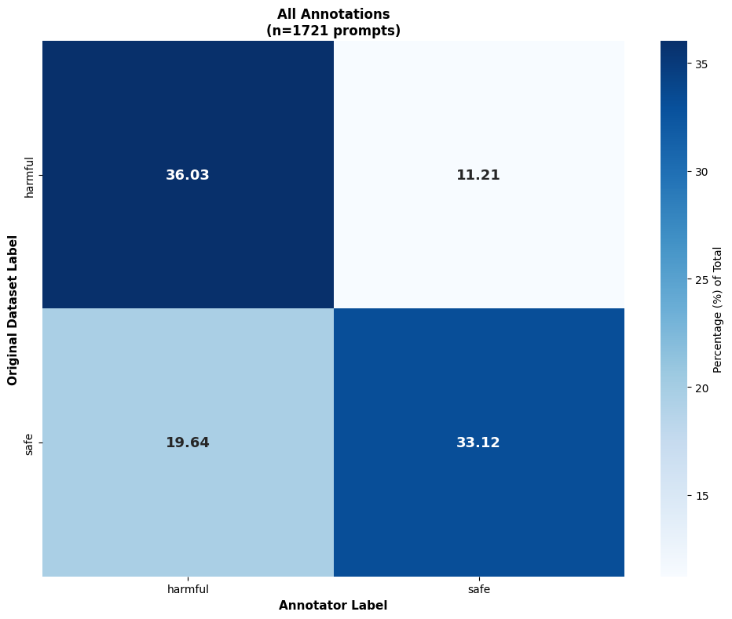
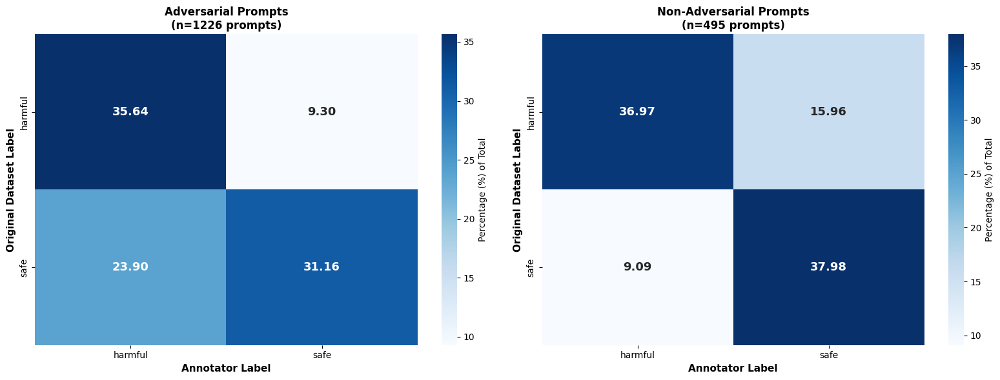

# Annotated Intent Dataset Statistics

Analysis of the annotated intent data derived from model predictions in the confidence range 0.35–0.65.

## Dataset Size and Composition

| Metric | Value |
|--------|-------|
| Total annotation entries | 1,767 |
| Entries with single annotation | 1,727 (97.74%) |
| Entries with multiple annotations | 40 (2.26%) |

## Flagged Samples

Some annotators marked prompts as "Flag for Removal" when they believed the sample should not be used (low quality or the annotaor already encountered it before):

| Metric | Value |
|--------|-------|
| Prompts (single-annotation) | 1,727 |
| Prompts flagged for removal | 211 (12.22%) |
| Prompts after flag removal | 1,516 |
| Unique prompts (after flag removal) | 1,254 |

## Duplicate Prompt Analysis

After removing flagged samples:

| Metric | Value |
|--------|-------|
| Total prompts | 1,516 |
| Unique prompts | 1,254 |
| Prompts without duplicates | 1,063 (84.77%) |
| Prompts with duplicates | 191 (15.23%) |
| Duplicate instances | 453 total annotations across duplicate prompts |
| Average annotations per duplicate prompt | 2.37 |

**Prompts with Multiple Intents for Analysis:**
- Multiple annotations: 40
- Duplicate prompts: 191 (453 instances)
- **Total:** 231

**Why Duplicates Exist:** These duplicate prompts appeared because we neglected to perform a deduplication step earlier in the analysis pipeline. However, this oversight provided a silver lining: the duplicates allow us to measure inter-annotator disagreement and consistency, as different annotators independently labeled the same prompts.

## Harm Label Distribution

Distribution of harm labels from human annotators across all annotations (including flagged samples):

The annotators used a 5-level harm classification scheme:

| Label | Count | Percentage |
|-------|-------|-----------|
| Completely Harmful | 536 | 27.63% |
| Completely Safe | 492 | 25.36% |
| Uncertain Safe | 363 | 18.71% |
| Uncertain Harmful | 336 | 17.32% |
| Flag for Removal | 213 | 10.98% |

**Label Definitions:**
- **Completely Safe:** Clearly harmless requests
- **Uncertain Safe:** Likely safe but with some ambiguity
- **Uncertain Harmful:** Likely harmful but with some ambiguity  
- **Completely Harmful:** Clearly harmful requests
- **Flag for Removal:** Quality issues, duplicates, or problematic samples

**Note:** 213 entries (10.98%) were flagged for removal, representing data quality issues, duplicates encountered by annotators, or ambiguous samples. These are excluded from the final parquet dataset. The sum of all labels is also higher than what is reported in the previous section because several prompts have multiple annotations.

## Annotator-Dataset Agreement

We compared human annotator labels with the original WildGuardMix dataset labels to measure consistency. For comparison with the binary dataset labels, we mapped the annotator's 5-level harm scale:
- **Harmful:** "Completely Harmful" and "Uncertain Harmful" 
- **Safe:** "Completely Safe" and "Uncertain Safe"
- **Excluded:** "Flag for Removal" entries

### Overall Confusion Matrix

The confusion matrix shows the relationship between original dataset labels (rows) and human annotator labels (columns). Each cell displays the percentage of total prompts that fall into that category.

**Reading the Matrix:**
- **Top-left (Harmful→Harmful):** Dataset labeled as harmful, annotator agreed it's harmful
- **Top-right (Harmful→Safe):** Dataset labeled as harmful, annotator disagreed and marked it safe
- **Bottom-left (Safe→Harmful):** Dataset labeled as safe, annotator disagreed and marked it harmful
- **Bottom-right (Safe→Safe):** Dataset labeled as safe, annotator agreed it's safe

The diagonal cells (top-left + bottom-right) represent agreement, while off-diagonal cells represent disagreement. The annotators and the dataset were generally in agreement since 70% of prompts fall into the diagonal cells.

### Confusion Matrix by Adversarial Status

We also observed the disagreement patterns between adversarial and non-adversarial prompts:

**Adversarial Prompts:**
- Show relatively higher disagreement rates
- Annotators believed that a large amount of adversarial prompts which the dataset labelled as safe were actually harmful.

**Non-Adversarial Prompts:**
- More straightforward classification cases
- Show higher agreement with original labels

## Usage

This cleaned and deduplicated annotation dataset is available at:
- **Hugging Face:** `Jazhyc/aims-safety-intents` (parquet format)

The parquet file contains the following columns:
- `ID`: Unique identifier for each annotation
- `Wildguard ID`: Original entry ID from Label Studio export
- `Duplicate ID`: Groups multiple annotations of the same prompt (NULL for unique prompts)
- `Prompt`: The input prompt text
- `Intent`: Annotator's description of the user's intent
- `Annotator Harm`: Annotator's harm classification
- `Dataset Harm`: Original WildGuardMix harm label
- `Adversarial`: Whether the prompt was adversarially generated
