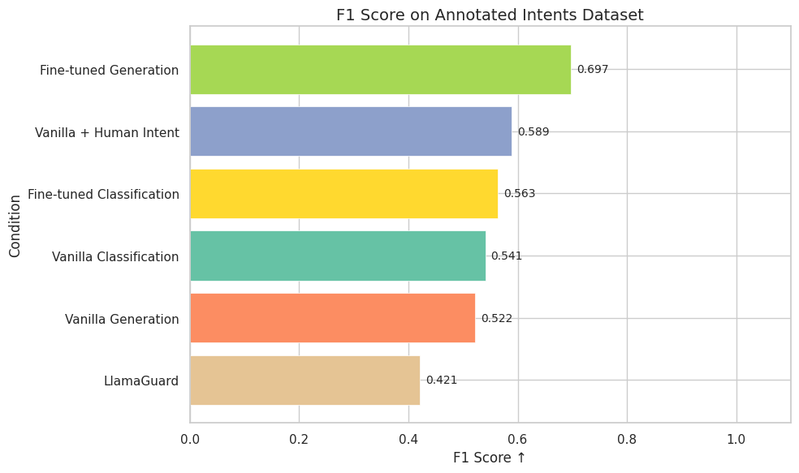
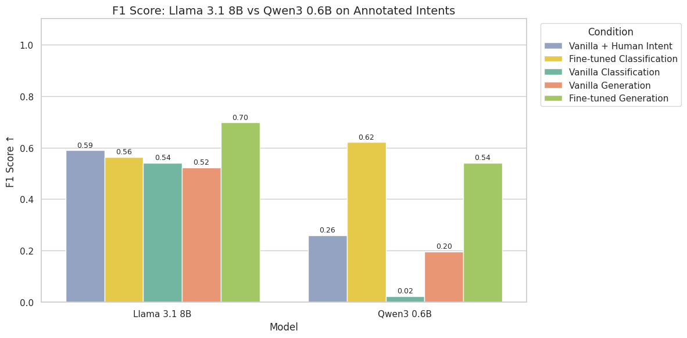
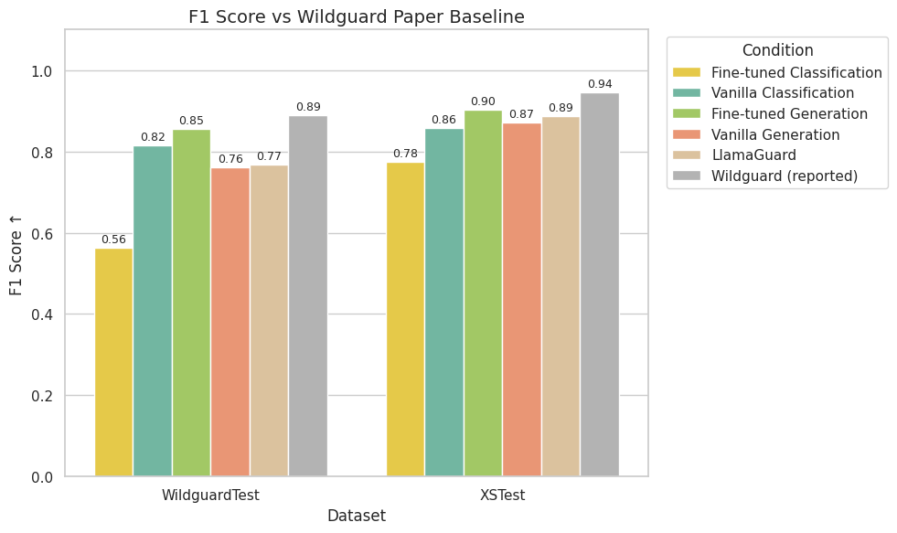

# Generation-Based Safety Classification Results

## Conditions

| Condition | Description |
|-----------|-------------|
| **Vanilla Classification** | Directly produce a harm label |
| **Vanilla Generation** | Reason about intent, then produce a harm label |
| **Vanilla + Human Intent** | Given human-annotated intent, produce a harm label |
| **Fine-tuned Classification** | Fine-tuned model directly produces a harm label |
| **Fine-tuned Generation** | Fine-tuned model reasons about intent, then produces a harm label |
| **LlamaGuard** | Meta's general-purpose safety classifier |
| **Wildguard (reported)** | Specialized safety classifier (paper-reported scores) |

---

## 1. Intent Generation Improves Harm Classification

**Key findings (Llama 3.1 8B on Annotated Intents):**
- Human intents provide strong signal for harm classification
- Fine-tuned generation outperforms vanilla approaches
- Generation-based methods outperform direct classification

---

## 2. Smaller Models Benefit More from Intent Generation. Opposite effect is seen with classification

**Key findings:**
- Performance gap between vanilla and intent-based approaches is larger for Qwen3 0.6B
- Intent generation compensates for limited model capacity
- Useful for resource-constrained deployments

---

## 3. Comparison with Baselines

**Key findings (WildguardTest & XSTest):**
- ✅ Outperforms LlamaGuard (general-purpose safety classifier)
- ❌ Lags behind Wildguard — trained on ~86K examples vs our ~1.5K human-annotated subset
- Intent generation is our best performing approach.
