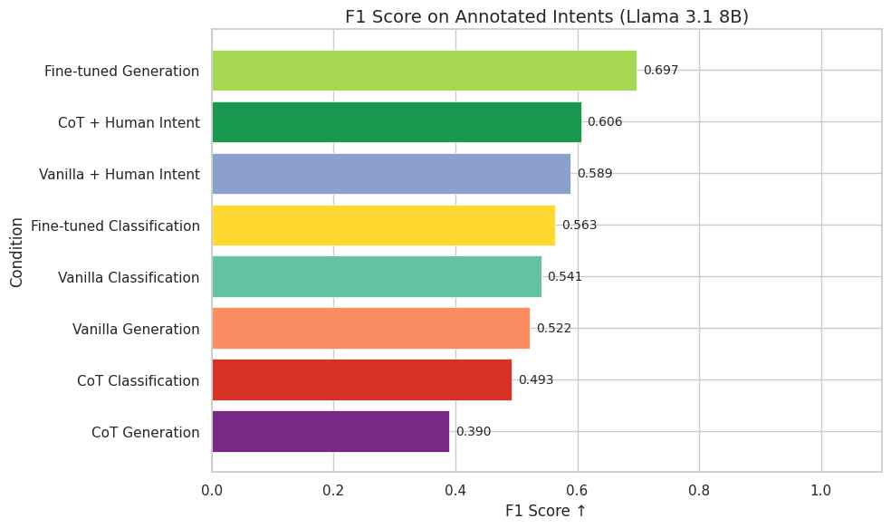
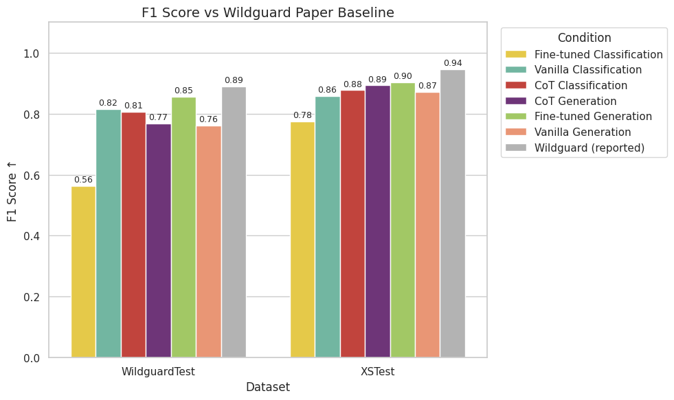

# Updated Baselines with CoT Conditions

Zero-shot CoT prompting was added as three new conditions (`zeroshot_cot_classification`, `zeroshot_cot_generation`, `zeroshot_cot_classification_with_intent`). The model is prompted to think step by step and output its reasoning explicitly in a structured JSON field, with `enable_thinking=False` to prevent Qwen3-style internal thinking from interfering.

## Annotated Intents (Llama 3.1 8B)

CoT without context hurts on the adversarial jailbreak dataset. CoT Classification (0.493) and CoT Generation (0.390) both fall below their vanilla counterparts (0.541, 0.522), suggesting the model over-rationalises borderline prompts as safe. The exception is CoT + Human Intent (0.606) which might indicate that the additional context helps ground reasoning.

## WildguardTest & XSTest (Llama 3.1 8B)

On WildguardTest, CoT Classification (0.81) matches Vanilla Classification (0.82) and CoT Generation (0.77) is comparable to Vanilla Generation (0.76). On XSTest both CoT conditions (0.88–0.90) are on par with or better than vanilla, though still below the Wildguard paper baseline (0.94).
