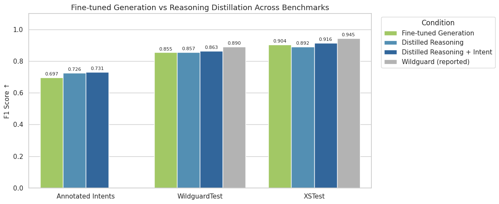

# Reasoning Distillation Results

Reasoning traces were generated by a large teacher model (Gemma 3 27B, `RedHatAI/gemma-3-27b-it-quantized.w4a16`) and used to fine-tune a smaller student model (Llama 3.1 8B) via sequence-level distillation. The same LoRA fine-tuning pipeline used in earlier experiments was reused, with the maximum token length increased to accommodate the longer reasoning outputs. Both adapters were trained on the annotated-intents dataset using LoRA (r=16, α=32) with QLoRA 4-bit quantization.

Two conditions were evaluated:

- **Distilled Reasoning**: Student trained on reasoning + harm traces only
- **Distilled Reasoning + Intent**: Student trained on reasoning + intent + harm traces

## Results

## Annotated Intents

Both distilled conditions outperform the fine-tuned generation baseline (which also uses intent information), suggesting that priviledged reasoning traces provide a stronger training signal than intent and labels alone. Distilled Reasoning + Intent achieves the highest F1 on this dataset by a small margin over Distilled Reasoning, indicating that the intent field adds marginal signal when reasoning is already present.

## WildguardTest & XSTest

The same pattern holds on held-out benchmarks. Both distilled conditions generalise better than fine-tuned generation. Distilled Reasoning + Intent remains the strongest of the two distilled models. However, all conditions still fall short of the reported Wildguard baseline (0.82 on WildguardTest, 0.94 on XSTest). This gap is likely explained by the scale of Wildguard's training data rather than the approach itself, as our models are trained on a much smaller annotated set.
